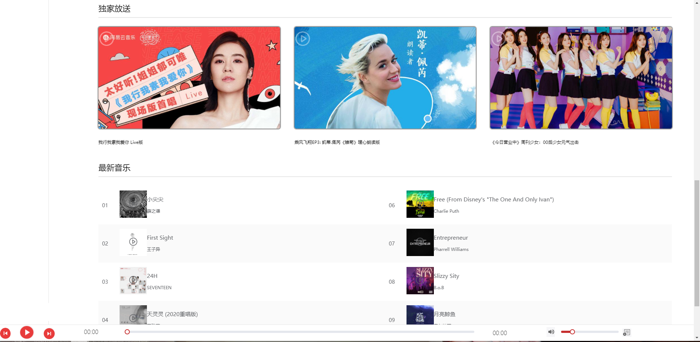
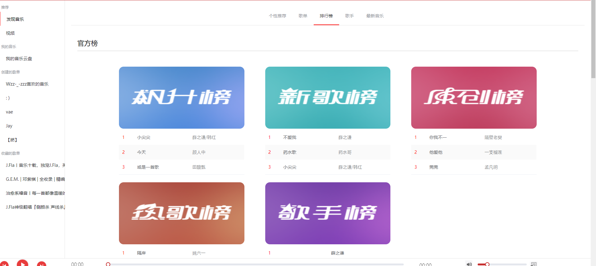
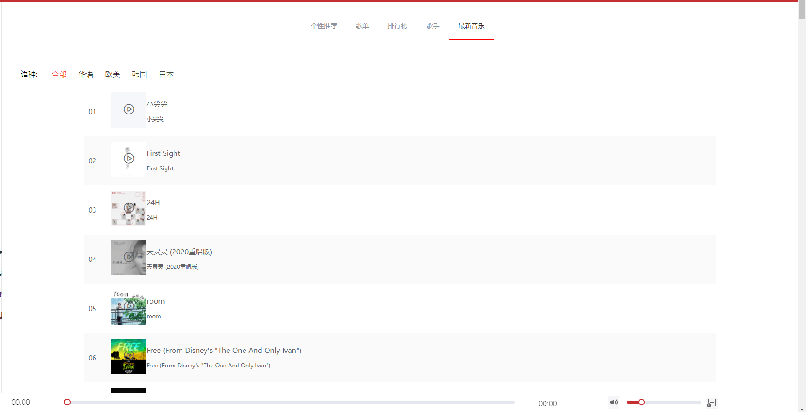
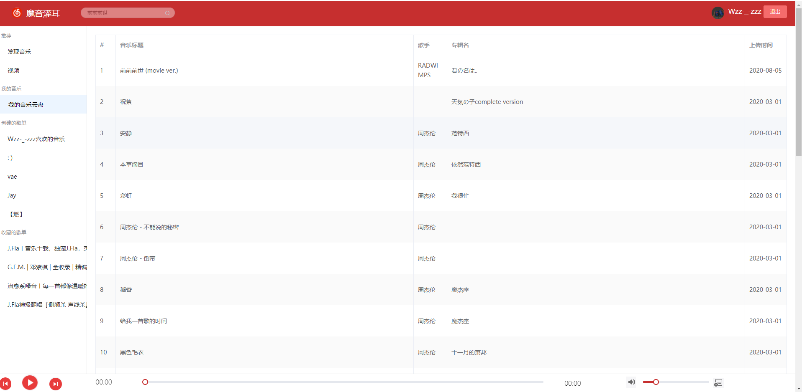
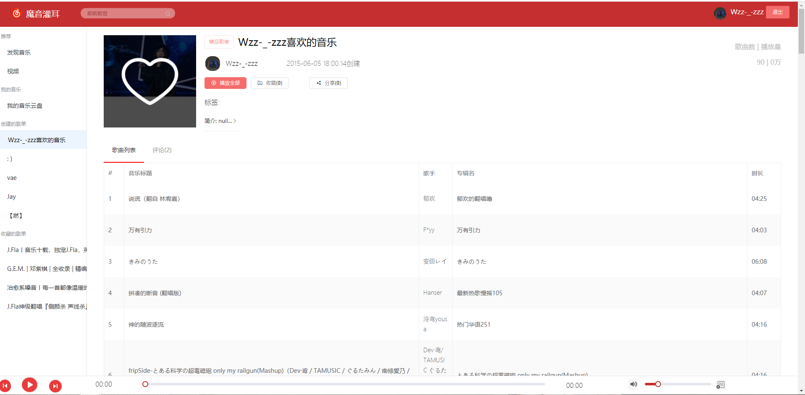
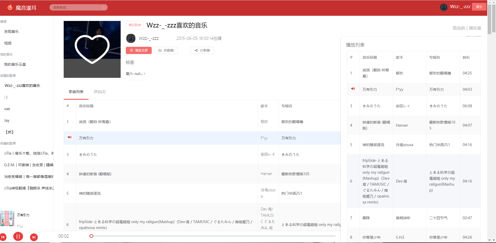
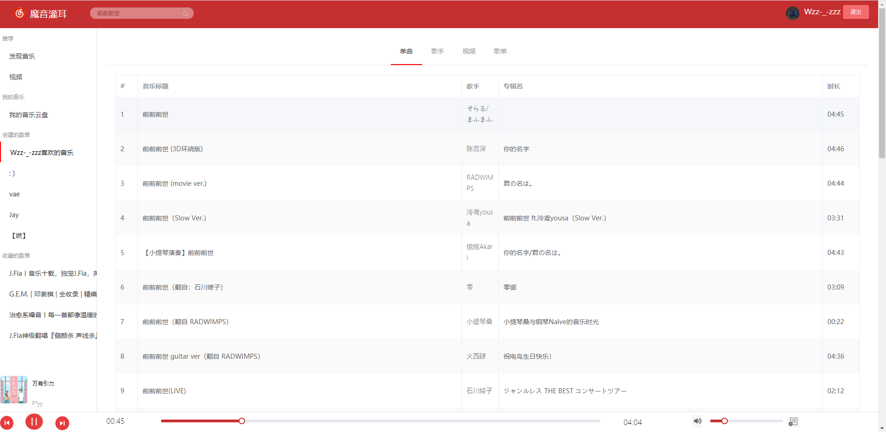
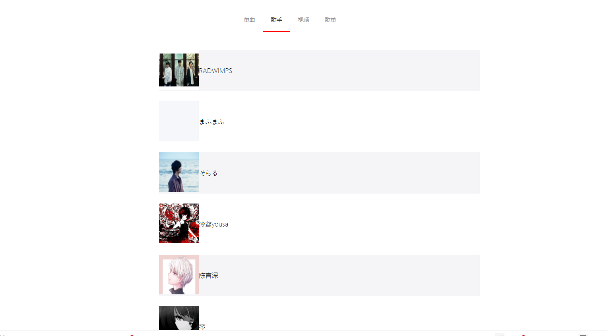

# vue_wzz_cloudMusic

一个个人仅供学习使用开发的高仿网易云音乐的完整项目~!

仅供个人学习~!

`请务必将文档看完, 很多问题都可以在文档中找到解决, 也可以加入群一起交流, 群号: 970804317 下面也会有二维码`
- # [ :point_right: 线上体验](http://music.wzzz.fun)
- [B站预览]( https://www.bilibili.com/video/BV1NC4y1b7eL)
图片预览在楼下
- [码云地址](https://gitee.com/wzhouzhou/vue_wzz_cloudMusic)
- [API地址](https://binaryify.github.io/NeteaseCloudMusicApi/#/?id=neteasecloudmusicapi)

# `最新版本更新日志(github由于国内速度太慢,最新版本请移至码云上!)`
- 2021/02/12 12:00
    1. 修复部分主页面BUG的UI
    2. 修复播放详情页UI
    3. 修复一些已知BUG

## 技术栈

> 1. VueCli
> 2. ElementUi
> 3. Vue

## 主要功能

- 网易云音乐官方热门榜单的banner轮播图
- 个性推荐模块,  歌单推荐模块, 歌单排行榜
- 歌手推荐信息, 独家放送模块 ,最新音乐模块
- 登录模块(网易账号),视频分类模块(需登录)
- 音乐云盘模块(需登录), 私人收藏歌单(需登录)
- 歌单播放, 单曲播放, 视频播放页面
- 歌词滚动播放, 歌曲详情页, 歌曲视频评论

## 项目预览

### 首页




### 歌单


### 排行榜




### 歌手


### 最新音乐




### 音乐云盘



### 歌单详情页






### 播放页


### 搜索页






## 快速启动

`当前项目目录下,路径输入cmd进入命令行`

```cmd
npm install # 安装项目所需的依赖(如果速度过慢, 可以尝试cnpm)
npm run serve #启动项目服务
```

此时, 浏览器打开, 输入网址http://localhost:8080,此时项目就完全跑起来了! 是不是觉得很简单呢 ? 其实就是这么简单快捷!

## 警告

> 1. 本项目仅用于学习练习, 本人不承担任何恶意使用后果
> 2. 本项目代码遵循开源协议

## 致谢

本项目基于或参考以下项目：

1. [后台接口项目](https://binaryify.github.io/NeteaseCloudMusicApi/#/?id=neteasecloudmusicapi)

## 推荐

[SpringBoot个人博客](https://github.com/wzz1206414629/privateBlog)

## 问题


- 开发学习问题或者好的建议可以给出反馈交流, 一起学习
- 如果有需要QQ群里提问，请在提问前先完成以下过程：
    * 请仔细阅读本项目文档，查看能否解决；
    * 百度或谷歌相关技术；
    * 查看相关技术的官方文档
    * 请提问前尽可能做一些思考分析，然后提问时给出详细的信息以及个人对问题的理解。

希望能与大家成为开发路上的好朋友~! 期待与你相遇~

- License

Copyright (c) 2020-person wangzhouzhou
